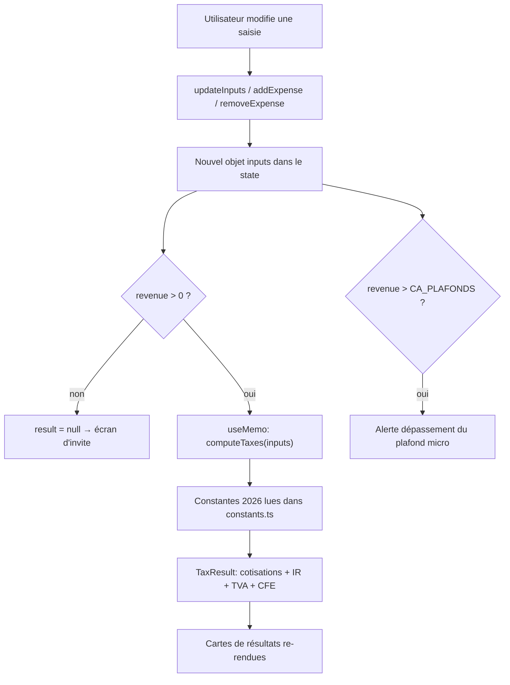
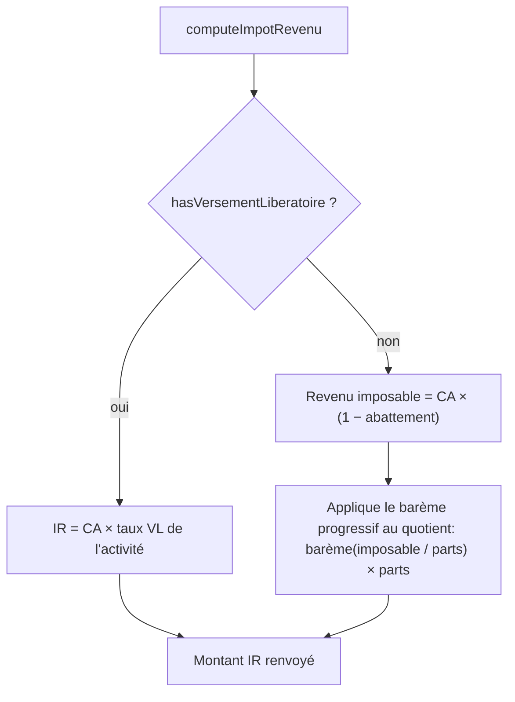
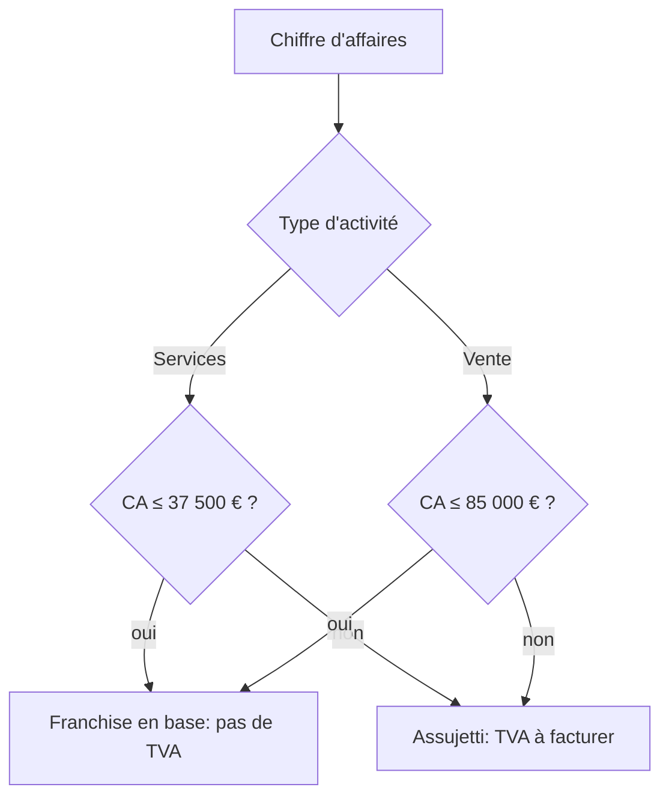

# Workflows (Mermaid)

Diagrammes des principaux flux. Voir [02-architecture.md](02-architecture.md) et [03-calculs-fiscaux.md](03-calculs-fiscaux.md) pour le détail.

## 1. Boucle de calcul en temps réel

## 2. Choix de la méthode d'impôt sur le revenu

## 3. Détermination du statut TVA

